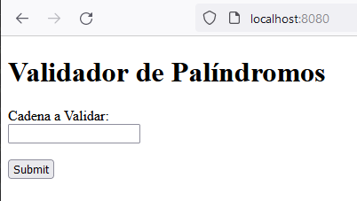
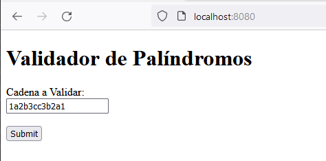
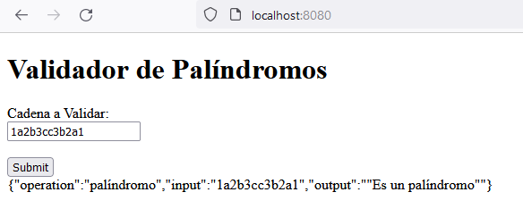
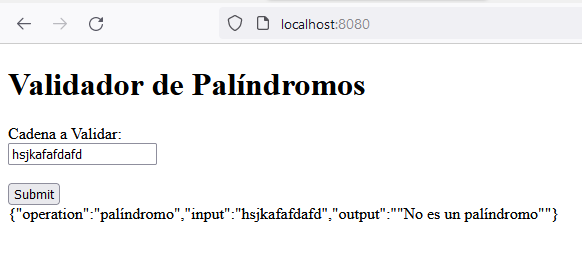

# Author: José Manuel Gamboa gómez

## Validador de Palíndromos

Este programa tiene como función el validar si una cadena es palíndromo o no.

__Palíndromo:__ Palíndromo Es una cadena que se lee igual si se lee de izquierda a derecha, que si se lee de derecha a izquierda.

Por ejemplo, "adbaeea" no es un palíndromo, pero en cambio, "aadbaeeabdaa" si es una palíndormo.
Otro ejemplo, "12785" no es una palíndromo, pero "127858721" si es una palíndromo.

Este proceso se realiza mediante un cliente HTTP con la siguiente interfaz:

Para poder realizar la validazión de cualquier cadena ya sea solo letras, números o una combinación de ambos, simplemente lo digitaremos en el campo de texto disponible:

Una vez hecho esto al pulsar el boton _Submit_ la aplicación enviará su cadena para que sea validada por otra aplicación ejecutandose en otro servidor. La respuesta será una de dos: Es un palíndromo o No es un palíndromo, una vez se tenga una respuesta bajo el boton _Submit_ se presenta el resultado de la validación en un formato JSON:

## Video Desmostración

- https://photos.app.goo.gl/utdMzTJo8RshYNZx6
